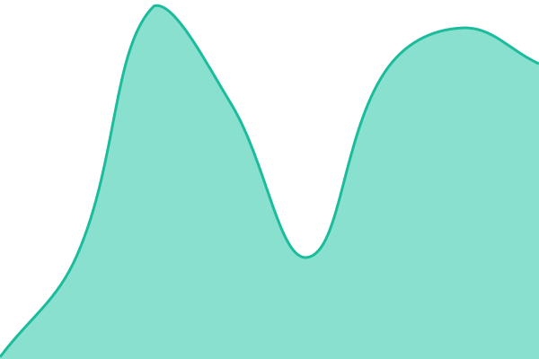
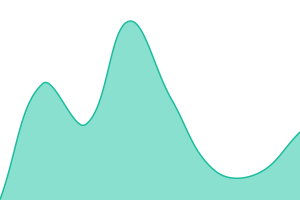
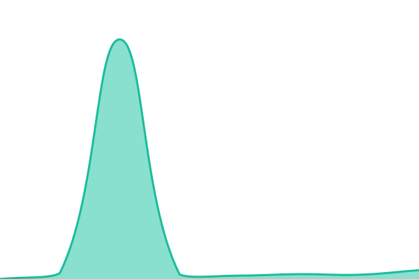

# [📈 Live Status](https://status.dsa-api.com): <!--live status--> **🟩 All systems operational**

This repository contains the open-source uptime monitor and status page for [Kraboo](https://status.dsa-api.com), powered by [Upptime](https://github.com/upptime/upptime).

With [Upptime](https://upptime.js.org), you can get your own unlimited and free uptime monitor and status page, powered entirely by a GitHub repository. We use [Issues](https://github.com/kraboo-labs/dsa-api-status/issues) as incident reports, [Actions](https://github.com/kraboo-labs/dsa-api-status/actions) as uptime monitors, and [Pages](https://status.dsa-api.com) for the status page.

<!--start: status pages-->
<!-- This summary is generated by Upptime (https://github.com/upptime/upptime) -->
<!-- Do not edit this manually, your changes will be overwritten -->
<!-- prettier-ignore -->
| URL | Status | History | Response Time | Uptime |
| --- | ------ | ------- | ------------- | ------ |
|  [API](https://api.dsa-api.com/v1/version) | 🟩 Up | [api.yml](https://github.com/kraboo-labs/dsa-api-status/commits/HEAD/history/api.yml) | 

 442ms
     
 | 

<a href="https://status.dsa-api.com/history/api">100.00%</a>
    

|  [API — health (DB-backed)](https://api.dsa-api.com/v1/health) | 🟩 Up | [api-health-db-backed.yml](https://github.com/kraboo-labs/dsa-api-status/commits/HEAD/history/api-health-db-backed.yml) | 

 430ms
     
 | 

<a href="https://status.dsa-api.com/history/api-health-db-backed">100.00%</a>
    

|  [Docs (Swagger UI)](https://docs.dsa-api.com/docs) | 🟩 Up | [docs-swagger-ui.yml](https://github.com/kraboo-labs/dsa-api-status/commits/HEAD/history/docs-swagger-ui.yml) | 

 445ms
     
 | 

<a href="https://status.dsa-api.com/history/docs-swagger-ui">100.00%</a>
    

|  [Open data — trusted-flaggers.json](https://raw.githubusercontent.com/kraboo-labs/dsa-data/main/data/trusted-flaggers.json) | 🟩 Up | [open-data-trusted-flaggers-json.yml](https://github.com/kraboo-labs/dsa-api-status/commits/HEAD/history/open-data-trusted-flaggers-json.yml) | 

 145ms
     
 | 

<a href="https://status.dsa-api.com/history/open-data-trusted-flaggers-json">100.00%</a>
    

|  [Open data — changelog.json](https://raw.githubusercontent.com/kraboo-labs/dsa-data/main/data/changelog.json) | 🟩 Up | [open-data-changelog-json.yml](https://github.com/kraboo-labs/dsa-api-status/commits/HEAD/history/open-data-changelog-json.yml) | 

 147ms
     
 | 

<a href="https://status.dsa-api.com/history/open-data-changelog-json">100.00%</a>
    

|  [Upstream — EU register](https://digital-strategy.ec.europa.eu/en/policies/trusted-flaggers-under-dsa) | 🟩 Up | [upstream-eu-register.yml](https://github.com/kraboo-labs/dsa-api-status/commits/HEAD/history/upstream-eu-register.yml) | 

 415ms
     
 | 

<a href="https://status.dsa-api.com/history/upstream-eu-register">100.00%</a>
    

<!--end: status pages-->

[**Visit our status website →**](https://status.dsa-api.com)

## 📄 License

- Powered by: [Upptime](https://github.com/upptime/upptime)
- Code: [MIT](./LICENSE) © [Anand Chowdhary](https://anandchowdhary.com)
- Data in the `./history` directory: [Open Database License](https://opendatacommons.org/licenses/odbl/1-0/)
